A language used to describe graphs. Files in this format have the `.dot` extension. The format looks like this:

```dot
graph graphname {
    // This attribute applies to the graph itself
    size="1,1";
    // The label attribute can be used to change the label of a node
    a [label="Foo"];
    // Here, the node shape is changed.
    b [shape=box];
    // These edges both have different line properties
    a -- b -- c [color=blue];
    b -- d [style=dotted];
    // [style=invis] hides a node.
}
```



To visualize the format, I can use [Graphviz](https://graphviz.org/about/) CLI tools. To install, run:

```bash
choco install graphviz -y
```

It can output into a variety of [formats](https://graphviz.org/docs/outputs/). To output to an `.svg` I can run:

```bash
dot -Tsvg graph.dot -o graph.svg
```

I can also use this [online visualizer](https://dreampuf.github.io/GraphvizOnline/) which stores the entire graph in the URL.